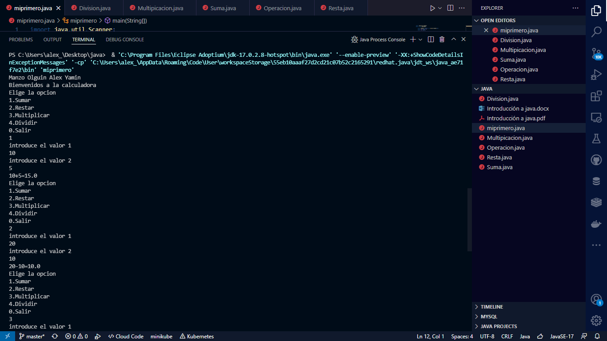

# Calculadora-Java
 Es calculadora hecha con herencia y metodos

## taller de introduccion a java

fue una platica aplicamos nos enseñaron algunas tecnicas para hacer en java.

 ## practica imagen 1

## segunda imagen 

.png)
## en los conceptos basicos
- OPP: (progrmacion orientada a objetos) :
un prpgrama que esta hecho de clases, con sus campos y metodos.
- Clase: es una agrupación de datos, variables atributos de funciones o métodos que manipulan estas variables.
- Objetos: es una instancia de una clase.
- Variable: es una localización de memoria que se utiliza para almacenar un valor determinado.
- Programa: colección de instancias para la computadora. Se le conoce como software.
- Compilador: convertir un programa escrito en un lenguaje como java a un lenguaje que la computadora pueda comprender.
- Interpretador: al ejecutar el programa el código de bytes es interpretado por otro programa conocido como máquina virtual de java.
- Instancia: sé invoca sabre un objeto de la clase al cual tiene acceso mediante la palabra this.
- Atributo: se guardan en variables denominados de instancia y casa objeto particular puede tener valores distintos para esas variables.

- Método: Un método se implementa en una clase, y determina cómo tiene que actuar el objeto cuando recibe un mensaje.

- Encapsulamiento

Como se puede observar de los diagramas, las variables del objeto se localizan en el centro o núcleo del objeto. Los métodos rodean y esconden el núcleo del objeto de otros objetos en el programa. Al empaquetamiento de las variables de un objeto con la protección de sus métodos se le llama encapsulamiento. Típicamente, el encapsulamiento es utilizado para esconder detalles de la puesta en práctica no importantes de otros objetos. Entonces, los detalles de la puesta en práctica pueden cambiar en cualquier tiempo sin afectar otras partes del programa.

El encapsulamiento de variables y métodos en un componente de software ordenado es, todavía, una simple idea poderosa que provee dos principales beneficios a los desarrolladores de software:

Modularidad, esto es, el código fuente de un objeto puede ser escrito, así como darle mantenimiento, independientemente del código fuente de otros objetos. Así mismo, un objeto puede ser transferido alrededor del sistema sin alterar su estado y conducta.
Ocultamiento de la información, es decir, un objeto tiene una "interfaz publica" que otros objetos pueden utilizar para comunicarse con él. Pero el objeto puede mantener información y métodos privados que pueden ser cambiados en cualquier tiempo sin afectar a los otros objetos que dependan de ello.

- Herencia
La herencia es un mecanismo que permite la definición de una clase a partir de la definición de otra ya existente. La herencia permite compartir automáticamente métodos y datos entre clases, subclases y objetos.

La herencia está fuertemente ligada a la reutilización del código en la OOP. Esto es, el código de cualquiera de las clases puede ser utilizado sin más que crear una clase derivada de ella, o bien una subclase.

Hay dos tipos de herencia: Herencia Simple y Herencia Múltiple. La primera indica que se pueden definir nuevas clases solamente a partir de una clase inicial mientras que la segunda indica que se pueden definir nuevas clases a partir de dos o más clases iniciales.

Superclase y Subclases
El concepto de herencia conduce a una estructura jerárquica de clases o estructura de árbol, lo cual significa que en la OOP todas las relaciones entre clases deben ajustarse a dicha estructura.

En esta estructura jerárquica, cada clase tiene sólo una clase padre. La clase padre de cualquier clase es conocida como su superclase. La clase hija de una superclase es llamada una subclase.

Una superclase puede tener cualquier número de subclases.

Una subclase puede tener sólo una superclase.

- Polimorfismo

Otro concepto de la OOP es el polimorfismo. Un objeto solamente tiene una forma (la que se le asigna cuando se construye ese objeto) pero la referencia a objeto es polimórfica porque puede referirse a objetos de diferentes clases (es decir, la referencia toma múltiples formas). Para que esto sea posible debe haber una relación de herencia entre esas clases.

